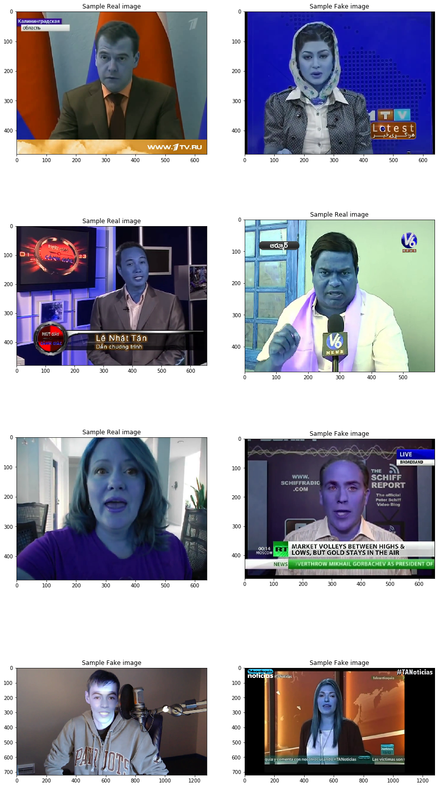
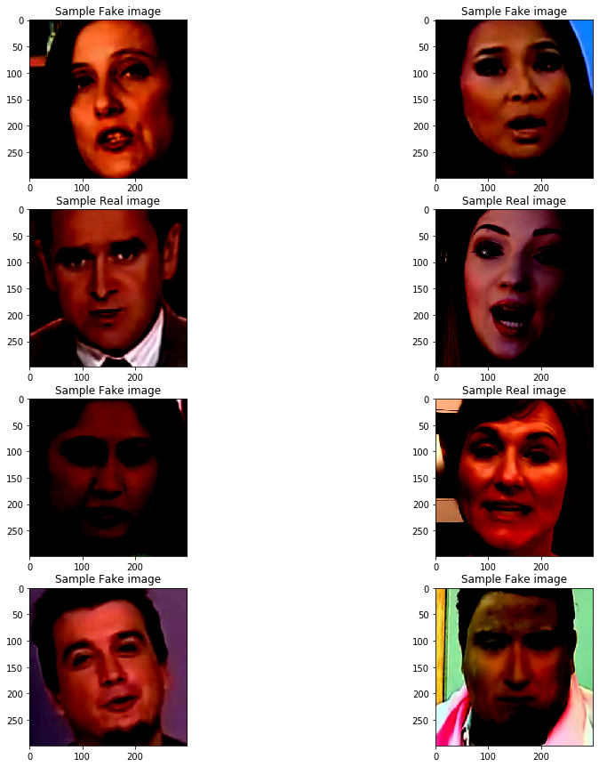

## Problem Statement

The rapid progress in synthetic image generation and manipulation has now come to a point where it raises significant concerns on the implication on the society. At best, this leads to a loss of trust in digital content, but it might even cause further harm by spreading false information and the creation of fake news. 
In this blog, we will build a machine learning model that learns to detect manipulated facial images. We have access to a dataset of fake and real videos. We have to train a model to predict whether the given video(or image sequence) is fake or real.
For more details, kindly go through this [link](https://www.groundai.com/project/faceforensics-learning-to-detect-manipulated-facial-images/1)

In this blog, let us discuss one approach to solve this problem statement. 
 

---

 
## Our Approach
 
Our objective is to build a model which would recognize whether the given video is **Real** or **Fake**.
Let us summarize the steps to solve the problem at hand: 
1. We will download the dataset from the [FaceForensics](https://github.com/ondyari/FaceForensics/blob/master/dataset/README.md) 
2. For our dataset, we chose two computer graphics-based approaches  (**Face2Face** and **FaceSwap** ) and a deep-learning-based approach  (**Deepfakes** ). These will give us manipulated videos.  
3. We will also download the original youtube videos from there.  
4. We will use the following script to download all images or videos.  
      `download-FaceForensics.py`
5. We will have to extract the sequence images from these videos. We will  use the following script provided by FaceForensics for extracting the  frames.   
 `python extracted_compressed_videos.py <output path> -d <"all" or single dataset via "Face2Face" or "original"> -c c0`
6. We will process all extracted images with a standard Dlib face detector to  get the face bounding boxes for further processing.  
7. We split the dataset into a fixed training, validation and test set.  
8. We build a CNN model to extract the image features and learn the weights to make the prediction of the manipulated videos.  
9. The above paper suggests that the classification based on XceptionNet outperforms all other variants in detecting fakes, we will also try to build our  model using XceptionNet .  
10. Once our CNN model is trained, we will predict the image sequences validity of the test videos.

---

## Data Collection

We will consider around 150 _fake_ and 151 _Original_ vedios for our model.
1. We will download 50 fake videos of each type. 
    `python faceforensics_download_v4.py data\fake -d Deepfakes -c c23 -t videos -n 50` 
    `python faceforensics_download_v4.py data\fake -d Face2Face -c c23 -t videos -n 50` 
    `python faceforensics_download_v4.py data\fake -d FaceSwap -c c23 -t videos -n 50`

2. We will download 151 original videos. 
   `python faceforensics_download_v4.py data\original -d youtube -c c23 -t videos -n 151`

3. We will extract the image sequence from these videos using the following commands. 
    `python extracted_compressed_videos.py --data_path data\fake -d Deepfakes -c c23` 
    `python extracted_compressed_videos.py --data_path data\fake -d Face2Face -c c23` 
    `python extracted_compressed_videos.py --data_path data\fake -d FaceSwap -c c23` 
    `python extracted_compressed_videos.py --data_path data\original -d original -c c23`

 

## The Image Preparation:
The images need to be processed, before feeding them to the model.

### Copy 50 image sequence for EACH video
We will go through these image sequences and collect 50 image sequence for EACH video and put all these in the folder <destination-folder>, say the folder name is _data_set_ .These images will be further processed and split into  
 _train, cv and test data_.
<pre><code><b>
## label value = 0 for fake and 1 for real
copy_images(manipulated_sequences_path,image_dir_path,dest_path,0)
copy_images(original_sequences_path,image_dir_path,dest_path,1)
</b></code></pre>
 
 ### Crop the face
 We must detect if the face has been manipulated, so we need to concentrate on the face portion of the image. 
 To achieve this we use one of the face tracking algorithms implemented in **dlib** which is python library, you can download using:  `pip install dlib`
<pre><code><b> 
# instantiating face detector from dlib library 
face_detector = dlib.get_frontal_face_detector()
faces = face_detector(image, 1)
</b></code></pre>

## EDA (Exploratory Data Analysis)

1. <b>Lets view some sample images before processing them:</b>
      <pre><code><b>
        plt.figure(figsize=(15,30))
        for i in range(8):
             random_value = randint(0,len(filenames_list)-1)
             sample_image = cv2.imread(os.path.join(dest_path,filenames_list[random_value]))
             plt.subplot(421+i)
             plt.title("Sample {} image".format("Fake" if labels[random_value] == 0 else "Real"))
             plt.imshow(sample_image)
      </b></code></pre>
 
  
 2. <b> Lets view few cropped and processed images:</b>
   <pre><code><b>
      plt.figure(figsize=(15,15))
      for i in range(8):
          random_value = randint(0,len(x_train)-1)    
          plt.subplot(421+i)    
          plt.title("Sample {} image".format("Fake" if np.argmax(y_train[random_value]) == 0 else "Real"))
          plt.imshow(x_train[random_value])
   </b></code></pre>
 
  
## Mapping the Business problem to a Machine Learning Problem

### Prepare data for the model
Our problem is a binary classification problem, we will have the label **0 for Real and 1 for Fake** (Deepfakes or Face2face or FaceSwap).

1. Lets split the cropped images into _train , cv and test_ sets.
<pre><code><b>
    X_train, X_test, Y_train, Y_test = train_test_split(X, y, test_size=0.33, shuffle=True, random_state=42)
    X_train, X_cv, Y_train, Y_cv = train_test_split(X_train, Y_train, test_size=0.33, random_state=42)
</b></code></pre>

2. We are using the Keras Xception model for training our data. Xception model provides us with a method to do some preprocessing
on the images. The method is `preprocess_input` and the same can be imported using
`from keras.applications.xception import preprocess_input`
<pre><code><b>   
    X_train = preprocess_input(X_train)
    X_cv = preprocess_input(X_cv)
    X_test = preprocess_input(X_test)
 </b></code></pre>

 
## Our Model
We will go with fine-tuning Xception model, with weights pre-trained on ImageNet.
  We will create the `Xception` model which has been been trained on heavy ImageNet data.
 
`Xception_model=Xception(include_top=False, weights='imagenet',input_shape=(299,299,3),pooling ='avg')` 

-**include_top**: whether to include the fully-connected layer at the top of the network.  
-**input_shape**: The default input size for this model is 299x299. We are using colored images so the `input_shape` is (299,299,3)   
-**pooling**: 'avg' means that global average pooling will be applied to the output of the last convolutional block, and thus the output of the model will be a 2D tensor.
 
### Model architecture:
<pre><code><b>
for layer in Xception_model.layers:
    layer.trainable = True

out_ = Xception_model.output
predicted = Dense(2,activation ='softmax')(out_)
model_face_forensic = Model(inputs= Xception_model.input, outputs = predicted)
model_face_forensic.compile(loss='categorical_crossentropy',optimizer='adam', metrics=['accuracy'])

checkpoint = ModelCheckpoint('model_face_forensic.h5', monitor='val_loss', save_best_only=True)
log_dir = "logs/fit/" + datetime.datetime.now().strftime("%Y%m%d-%H%M%S")
tensorboard_callback = tf.keras.callbacks.TensorBoard(log_dir=log_dir, histogram_freq=1)

history_face_forensic = model_face_forensic.fit(x_train, np.array(y_train),validation_data=(x_cv, np.array(y_cv)),
                                              callbacks=[checkpoint,tensorboard_callback], batch_size = 32, verbose=2, epochs=12)

</b></code></pre>

### Lets save the trained model:
 `model_face_forensic.save("model_face_forensics.hdf5")`
 
### Plotting the training and validation accuracy helps to understand the model behaviour over different epochs:
<pre><code><b>
    def plot_graphs(history, metric):    
        plt.plot(history.history[metric])    
        plt.plot(history.history['val_'+metric], '')    
        plt.xlabel("Epochs")    
        plt.ylabel(metric)    
        plt.legend([metric, 'val_'+metric])    
        plt.show()        
    plot_graphs(history_face_forensic,'accuracy') 
    plot_graphs(history_face_forensic,'loss')  
  </b></code></pre>
 
 ### Lets evaluate the performance of our trained model on the Test data:
 <pre><code><b>
    scores = model_face_forensic.evaluate(x_test,np.array(y_test),verbose=0)
    print("%s: %.2f%%" % (model_face_forensic.metrics_names[1], scores[1]*100))
 </b></code></pre>
   
### Last but not the least, lets not forget the predict method:
<pre><code><b>
   #For testing any new video
   output_file_name = test_full_image_network(video_path='033_097.mp4', num_of_frames=100)
</b></code></pre>
 
The method `test_full_image_network` would take in any vedio, extract _num_of_frames_ frames from the vedio and follow the
image processing steps as done before training our model. These steps are face detection, image cropping, image resizing and then feeding the images to `preprocess_input`.
  Once the images are processed we load the model which was saved earlier and call the predict method.
<pre><code><b>
   prediction = model.predict(cropped_image)[0]
</b></code></pre>

According to the prediction, the images are saved into a new output vedio which shows the vedio with a boxed face labelled as "fake" or "Real" with the confidence level of prediction.

The output vedio can be viewed using HTML
`from IPython.display import HTML`
`HTML('<iframe width="560" height="315" src="{0}" frameborder="0" allowfullscreen></iframe>'.format(output_file_name))`
 

### Future work
  1. The performance of the model can be further improved by fine tuning the hyper parameters of the model.
  2. We can try to use different set (varities) of vedios to further finetune our model.
  3. We can try different CNN models to check the performance.

## References
 
 1. I have done this case study as part of [appliedaicourse](https://www.appliedaicourse.com/)
 2. https://www.groundai.com/project/faceforensics-learning-to-detect-manipulated-facial-images/1
 3. https://github.com/ondyari/FaceForensics
  
 
