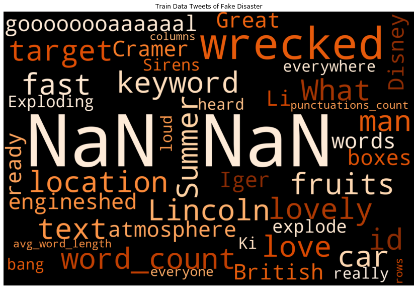

## Problem Statement

Twitter has become an important communication channel in times of emergency. The ubiquitousness of smartphones enables people to announce an emergency they’re observing in real-time. Because of this, more agencies are interested in programatically monitoring Twitter (i.e. disaster relief organizations and news agencies).
In this competition, you’re challenged to build a machine learning model that predicts which Tweets are about real disasters and which one’s aren’t.

In this blog, let us discuss one approach to solve this problem statement. 
 

---

 
## Our Approach

The problem in hand is to build a machine learning model that predicts which Tweets are about real disasters and which one’s aren’t. 

Any machine learning model has to learn the weights for the features on which the model is trained. For any NLP task like this one, we have different approaches to convert the textual data into the format in which the machine can read it and learn.
  

<u>Context-free models </u>such as <b>word2vec</b> or  <b>GloVe</b> generate a single <u>"word embedding"</u> representation for each word in the vocabulary, so <i>bank</i> would have the same representation in <i>bank deposit</i>  and  <i>river bank</i> . 
  <u>Contextual models </u>instead generate a representation of each word that is based on the other words in the sentence.

 <b>BERT, or Bidirectional Encoder Representations from Transformers</b>, is a new method of pre-training language representations which obtains state-of-the-art results on a wide array of Natural Language Processing (NLP) tasks.
  
<b>BERT</b> was built upon recent work in pre-training contextual representations — including <b>Semi-supervised Sequence Learning, Generative Pre-Training, ELMo, and ULMFit </b>— but crucially these models are all unidirectional or shallowly bidirectional. This means that each word is only contextualized using the words to its left (or right). 

For example, in the sentence -->
 <i>I made a bank deposit </i>  the unidirectional representation of  <i>bank</i> is only based on <i>I made a </i>  but not deposit.
 
Some previous work does combine the representations from separate left-context and right-context models, but only in a "shallow" manner. 

BERT represents <i> "bank" </i> using both its left and right context —  I made a ... deposit — starting from the very bottom of a deep neural network, so it is deeply bidirectional.
 
For more details on the in depth working of BERT, kindly refer <a> https://github.com/google-research/bert </a>
  
We have a small training dataset and few features. 
 As the training  dataset is small, it is better to use a pre trained BERT model to get the  embedding for the sentence, that we can use for classification. 

## Data Format

We have access to a dataset of 10,000 tweets that were hand classified.
We are predicting whether a given tweet is about a real disaster or not. 
If so, predict a 1 
If not, predict a 0 

Click [here](https://www.kaggle.com/c/nlp-getting-started){:target="_blank"} for more details.

## The features involved are

1. id - a unique identifier for each tweet
2. text - the text of the tweet
3. location - the location the tweet was sent from (may be blank)
4. keyword - a particular keyword from the tweet (may be blank)
5. target - in train.csv only, this denotes whether a tweet is about a real disaster (1) or not (0)

## EDA (Exploratory Data Analysis)

Let us analyse the data a bit.

 1. <b>Lets check on the 'target', the dependent variable distribution:</b>
      <pre><code><b>
        sns.barplot(target_value_count.index,target_value_count.values,palette="rainbow")
      </b></code></pre> 
 
  
 2. <b> Checking for the TOP 'keywords'</b>
   <pre><code><b>
      keyword_value_count = train_df["keyword"].value_counts()
      plt.barh(y=list(keyword_value_count.index)[:10],width=keyword_value_count.values[:10],color= 'rgbkymc')
   </b></code></pre>
 
   
3. <b>Distribution of 'keywords' for Real and Fake tweets:</b> 
The complete code for <i>univariate_barplots</i> is available at <a href="https://github.com/rashmisom/Tweets-NLP-sentiment"> here </a>
 <pre><code><b>
      univariate_barplots(train_df,'keyword','target',1,21) 
 </b></code></pre>
 
 
4. <b>Distribution of 'Location' for Real and Fake tweets:</b> 
<pre><code><b>
     univariate_barplots(train_df,'location','target',1,41)
</b></code></pre>
 
  
 5. <b>Lets see the 'Number of words" in the tweets:</b> 
<pre><code><b>
     disaster_word_count = train_df[train_df['target']==1]['text'].str.split().apply(len)
     disaster_word_count = disaster_word_count.values
     fake_word_count = train_df[train_df['target']==0]['text'].str.split().apply(len)
     fake_word_count = fake_word_count.values
     # the box plot
     plt.boxplot([disaster_word_count, fake_word_count])
     # the distribution plot
     sns.distplot(disaster_word_count, hist=False, label="Real Disaster")
     sns.distplot(fake_word_count, hist=False, label="Fake Disaster")

</b></code></pre>
 
  
 
 
 6. <b>Number of characters in the tweet text:</b> 
 <pre><code><b>
     ax1.hist(real_char_len,color='blue')
     ax2.hist(fake_char_len,color='green')
</b></code></pre>
 
 
  7. <b>Average word length in a tweet text:</b> 
 <pre><code><b>
     sns.distplot(real_disaster_word_count.map(lambda x: np.mean(x)),ax=ax1,color='blue')
     sns.distplot(fake_disaster_word_count.map(lambda x: np.mean(x)),ax=ax2,color='green')
</b></code></pre>
 
 
   8. <b>The punctuation marks in the tweets:</b> 
 <pre><code><b>
     sns.distplot(real_disaster_punctuation_marks,ax=ax1,color='blue')
     sns.distplot(fake_disaster_punctuation_marks,ax=ax2,color='green')
</b></code></pre>
 
 
   9. <b>Word Cloud for the real and fake disaster tweets:</b> 
 <pre><code><b>
     tweet_wordcloud(train_df[train_df["target"]==1], title="Train Data Tweets of Real Disaster")
     tweet_wordcloud(train_df[train_df["target"]==0], title="Train Data Tweets of Fake Disaster")
</b></code></pre>
   
 
 
## Mapping the Business problem to a Machine Learning Problem

### Prepare data for the model
We load the data from the train.csv and test.csv files.
<pre><code><b>
train_df = pd.read_csv("train.csv")
test_df = pd.read_csv("test.csv")
  </b></code></pre>
 
 
 Once we have the data loaded, we must preprocess the data before submitting it to the ML model for training.
 Lets look into abstract of the data preprocessing and the details of the same is available on the <a>https://github.com/rashmisom/Tweets-NLP-sentiment </a>.

<pre><code><b>   
        ## decontract the text,remove html etc
        sent = cleanText(sentance)
        ## some more data updates
        sent = sent.replace('\\r', ' ').replace('\\"', ' ').replace('\\n', ' ').replace(",000,000", "m")\
                           .replace(",000", "k").replace("′", "'").replace("’", "'")\
                           .replace("won't", "will not").replace("cannot", "can not").replace("can't", "can not")\
                           .replace("n't", " not").replace("what's", "what is").replace("it's", "it is")\
                           .replace("'ve", " have").replace("i'm", "i am").replace("'re", " are")\
                           .replace("he's", "he is").replace("she's", "she is").replace("'s", " own")\
                           .replace("%", " percent ").replace("₹", " rupee ").replace("$", " dollar ")\
                           .replace("€", " euro ").replace("'ll", " will")
        sent = re.sub('[^A-Za-z0-9]+', ' ', sent)
        ## correct the spellings
        sent = correct_spellings(sent)
        ## remove the stopwords
        sent = ' '.join(e for e in sent.split() if e not in stopwords and e not in punctuations)
  </b></code></pre>

 
## How to use BERT for text classification. Lets look into the steps one by one:
### We will use the official tokenization script created by the Google team.
<pre>
!wget --quiet https://raw.githubusercontent.com/tensorflow/models/master/official/nlp/bert/tokenization.py </pre>

The processes of tokenisation involves splitting the input text into list of tokens that are available in the vocabulary.  

### Let us load BERT from the Tensorflow Hub:
<pre><code><b>
    module_url = "https://tfhub.dev/tensorflow/bert_en_uncased_L-12_H-768_A-12/1"
    bert_layer = hub.KerasLayer(module_url, trainable=True)
</b></code></pre>

### Next, we prepare the tokenizer using the tf-hub model:
In order to pre-process the input and feed it to BERT model, we need to use a tokenizer.
<pre><code><b>
    # Load tokenizer from the bert layer
    vocab_file = bert_layer.resolved_object.vocab_file.asset_path.numpy()
    do_lower_case = bert_layer.resolved_object.do_lower_case.numpy()
    tokenizer = tokenization.FullTokenizer(vocab_file, do_lower_case)  
  </b></code></pre>
We next build a custom layer using Keras, integrating BERT from tf-hub.

### Encode the text into tokens, masks and segments:
BERT requires pre-processed inputs. It supports the tokens signature, which assumes pre-processed inputs: input_ids, input_mask, and segment_ids. To achieve this, we encode the data using the tokenizer built in the previous step. 
The deails of the method <u>bert_encode</u> will be discussed later.
<pre><code><b>
    train_input = bert_encode(train_df.clean_text.values, tokenizer, max_len=160)
    train_labels = train_df.target.values
  </b></code></pre>
  
### Build the model and train it:
<pre><code><b>
    model_tweet_BERT = build_model(bert_layer, max_len=160)
    checkpoint = ModelCheckpoint('model_tweet.h5', monitor='val_loss', save_best_only=True)    
    bert_history = model_tweet_BERT.fit(
    train_input, train_labels,
    validation_split = 0.2,
    epochs = 4, 
    callbacks=[checkpoint],
    batch_size = 32,
    verbose=2
    )
  </b></code></pre>
  
### Lets check the layers of our model. We will build the model using KERAS layer on top of the BERT layer.
This method will build the Model to be trained. This will take the output of the BERT later, send it to the sigmoid activation layer for classification.
 <pre><code><b>
def build_model(bert_layer, max_len=512):
    input_word_ids =  tf.keras.layers.Input(shape=(max_len,), dtype=tf.int32, name="input_word_ids")
    input_mask =  tf.keras.layers.Input(shape=(max_len,), dtype=tf.int32, name="input_mask")
    segment_ids =  tf.keras.layers.Input(shape=(max_len,), dtype=tf.int32, name="segment_ids")
    _, sequence_output = bert_layer([input_word_ids, input_mask, segment_ids])
    clf_output = sequence_output[:, 0, :]
    x =  tf.keras.layers.Dropout(0.2)(clf_output)
    out =  tf.keras.layers.Dense(1, activation='sigmoid')(x)    
    model =  tf.keras.Model(inputs=[input_word_ids, input_mask, segment_ids], outputs=out)
    model.compile(tf.keras.optimizers.Adam(lr=2e-5), loss='binary_crossentropy', metrics=['accuracy'])    
    return model
    </b></code></pre>  
 
### Lets look into the bert_encode method which we are using to encode the text data for feeding it to the BERT layer.
 The method will encode the 'text' column of train data. The BERT layer needs token, mask and the segment separator.
 We first tokenize the sentence using the tokenizer created from vocab.txt . We add [CLS] to start of sentence and [SEP] to the end of the sentence. Finally, we pad the sentence with 0. As we are dealing with one sentence per example, we set segment_id to be 0 and further we set mask to 1 for all tokens.We set this mask to 0 beyond the number of tokens.
 <pre><code><b>
def bert_encode(texts, tokenizer, max_len=512):
    all_tokens = []
    all_masks = []
    all_segments = []    
    for text in texts:
        text = tokenizer.tokenize(text)
        text = text[:max_len-2]
        input_sequence = ["[CLS]"] + text + ["[SEP]"]
        pad_len = max_len - len(input_sequence)        
        tokens = tokenizer.convert_tokens_to_ids(input_sequence)
        tokens += [0] * pad_len
        pad_masks = [1] * len(input_sequence) + [0] * pad_len
        segment_ids = [0] * max_len      
        all_tokens.append(tokens)
        all_masks.append(pad_masks)
        all_segments.append(segment_ids)    
    return np.array(all_tokens), np.array(all_masks), np.array(all_segments)
    </b></code></pre>
     
### Last but not the least, lets not forget the Test data and predict method:
<pre><code><b>
    # Encode the text into tokens, masks and segments
    test_input = bert_encode(test_df.clean_text.values, tokenizer, max_len=160)
    # Build the model
    model_tweet_BERT = build_model(bert_layer, max_len=160)    
    # load weights
    model_tweet_BERT.load_weights("model_tweet.h5")   
    y_pred = model_tweet_BERT.predict(test_input)
  </b></code></pre>

## Model performance:
The model is a binary classification model and we can check the accuracy of the trained model and plot the accuracy and loss graphs to check on the model performance.
<pre><code><b>
    print(bert_history.history["accuracy"])
    print(bert_history.history["val_accuracy"])    
    plot_graphs(bert_history,"accuracy")
 </b></code></pre>
 

How can we forget the utility method
<pre><code><b>
def plot_graphs(history, metric):
    plt.plot(history.history[metric])
    plt.plot(history.history['val_'+metric], '')
    plt.xlabel("Epochs")
    plt.ylabel(metric)
    plt.legend([metric, 'val_'+metric])
    plt.show()
    
  </b></code></pre>

  
 ### Kaggle Submission
 
On submitted the predicted values for the test dataset, the kaggle score came as shown in the image below and this can be further    improved by the suggestions listed in the <i>Future Work</i> section of this blog.

 
 
 ### Future work
  1. The performance of the model can be further improved by fine tuning the hyper parameters of the model.
  2. Instead of fine tuning the BERT module, we can try to train only the top two or top four layers and check out result.

 ## References
 
 1. I have done this case study as part of [appliedaicourse](https://www.appliedaicourse.com/)
 2. https://github.com/google-research/bert
 3. http://jalammar.github.io/illustrated-bert/
 4. https://github.com/huggingface/transformers
 
