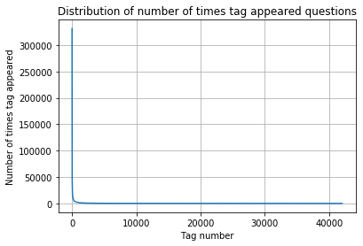

We all know [stackoverflow](https://stackoverflow.com){:target="_blank"}. It has questions and answers. Now, do we know these questions are tagged? A tag is a word or phrase that describes the topic of the question. Tags are a means of connecting experts with questions they will be able to answer by sorting questions into specific, well-defined categories. Tags can also be used to help you identify questions that are interesting or relevant to you.
  
In this blog, let us discuss the tagging predictor. 
<b>stackoverflow tag predictor</b> we have analysed this ML problem as part of [appliedaicourse](https://www.appliedaicourse.com/){:target="_blank"}.
So lets get started on understanding the complete but simple steps to do the TAG PREDICTION.

---

 
## Problem Statement

Predict the tags (a.k.a. keywords, topics, summaries), given only the question text and its title.

Read the full problem statement on [kaggle](https://www.kaggle.com/c/facebook-recruiting-iii-keyword-extraction/){:target="_blank"} 

## Business Objectives and Constraints

1. Predict tags with high [precision and recall](https://goo.gl/csnXGo){:target="_blank"}
3. No strict latency constraints.

---

### Data Format

Data contains 4 fields

1. Id - Unique identifier for each question

2. Title - The question's title

3. Body - The body of the question, contains text description and may also contain code snippet

4. Tags - The tags associated with the question

Click [here](https://www.kaggle.com/c/facebook-recruiting-iii-keyword-extraction/data){:target="_blank"} for more details.

### Sample data point

<b>Id</b>: 5

<b>Title:</b>Implementing Boundary Value Analysis of Software Testing in a C++ program?

<b>Body:</b>

<pre><code>
        #include&lt;
        iostream&gt;\n
        #include&lt;
        stdlib.h&gt;\n\n
        using namespace std;\n\n
        int main()\n
        {\n
                 int n,a[n],x,c,u[n],m[n],e[n][4];\n         
                 cout&lt;&lt;"Enter the number of variables";\n         cin&gt;&gt;n;\n\n         
                 cout&lt;&lt;"Enter the Lower, and Upper Limits of the variables";\n         
                 for(int y=1; y&lt;n+1; y++)\n         
                 {\n                 
                    cin&gt;&gt;m[y];\n                 
                    cin&gt;&gt;u[y];\n         
                 }\n         
                 for(x=1; x&lt;n+1; x++)\n         
                 {\n                 
                    a[x] = (m[x] + u[x])/2;\n         
                 }\n         
                 c=(n*4)-4;\n         
                 for(int a1=1; a1&lt;n+1; a1++)\n         
                 {\n\n             
                    e[a1][0] = m[a1];\n             
                    e[a1][1] = m[a1]+1;\n             
                    e[a1][2] = u[a1]-1;\n             
                    e[a1][3] = u[a1];\n         
                 }\n         
                 for(int i=1; i&lt;n+1; i++)\n         
                 {\n            
                    for(int l=1; l&lt;=i; l++)\n            
                    {\n                 
                        if(l!=1)\n                 
                        {\n                    
                            cout&lt;&lt;a[l]&lt;&lt;"\\t";\n                 
                        }\n            
                    }\n            
                    for(int j=0; j&lt;4; j++)\n            
                    {\n                
                        cout&lt;&lt;e[i][j];\n                
                        for(int k=0; k&lt;n-(i+1); k++)\n                
                        {\n                    
                            cout&lt;&lt;a[k]&lt;&lt;"\\t";\n               
                        }\n                
                        cout&lt;&lt;"\\n";\n            
                    }\n        
                 }    \n\n        
                 system("PAUSE");\n        
                 return 0;    \n
        }\n
        </code></pre>

<b>Tags</b>:'c++ c'

---
## Mapping the Business problem to a Machine Learning Problem 

### Type of Machine Learning Problem

<b><i>It is a multi-label classification problem.</i></b>

In Multi-label Classification, multiple labels (in this problem its tags) may be assigned to each instance and there is no constraint on how many of the classes the instance can be assigned to.
Source: [Wiki](https://en.wikipedia.org/wiki/Multi-label_classification){:target="blank"}

Find more about multi-label classification problem [here](http://scikit-learn.org/stable/modules/multiclass.html){:target="blank"}

A question on Stackoverflow might be about any of C, Pointers, JAVA, Regex, FileIO and/or memory-management at the same time or none of these.

### Performance metric

<b>Micro-Averaged F1-Score (Mean F Score) </b>: 
The F1 score can be interpreted as a weighted average of the precision and recall, where an F1 score reaches its best value at 1 and worst score at 0. The relative contribution of precision and recall to the F1 score are equal. The formula for the F1 score is:

<i>F1 = 2 * (precision * recall) / (precision + recall)</i> 

In the multi-class and multi-label case, this is the weighted average of the F1 score of each class.  

<b>'Micro f1 score': </b> 
Calculate metrics globally by counting the total true positives, false negatives and false positives. This is a better metric when we have class imbalance.
 

<b>'Macro f1 score': </b> 
Calculate metrics for each label, and find their unweighted mean. This does not take label imbalance into account.
 

https://www.kaggle.com/wiki/MeanFScore  
http://scikit-learn.org/stable/modules/generated/sklearn.metrics.f1_score.html  
 
<b> Hamming loss </b>: The Hamming loss is the fraction of labels that are incorrectly predicted.  
https://www.kaggle.com/wiki/HammingLoss  

---
## EDA (Exploratory Data Analysis)

We can save the csv files in the db files and continue with our data analysis.

<pre><code>
if not os.path.isfile('train.db'):
    start = datetime.now()
    disk_engine = create_engine('sqlite:///train.db')
    start = dt.datetime.now()
    chunksize = 180000
    j = 0
    index_start = 1
    for df in pd.read_csv('Train.csv', names=['Id', 'Title', 'Body', 'Tags'], chunksize=chunksize, 
                          iterator=True, encoding='utf-8', ):
        df.index += index_start
        j+=1
        print('{} rows'.format(j*chunksize))
        df.to_sql('data', disk_engine, if_exists='append')
        index_start = df.index[-1] + 1
    print("Time taken to run this cell :", datetime.now() - start)
  
  </code></pre>

Lets do a the data analysis now:

1. <b>Counting the number of rows:</b> 
      <pre><code>
        num_rows = pd.read_sql_query("""SELECT count(*) FROM data""", con)
      </code></pre>
    and we get total row count as: 6034196

2. <b> Checking for duplicates
   <pre><code>
      df_no_dup = pd.read_sql_query('SELECT Title, Body, Tags, COUNT(*) as cnt_dup FROM data GROUP BY Title, Body, Tags', con)
      print("number of duplicate questions :", num_rows['count(*)'].values[0]- df_no_dup.shape[0], "(",(1-((df_no_dup.shape[0])/(num_rows['count(*)'].values[0])))*100,"% )")
   </code></pre>
    
    and we get : number of duplicate questions : 1827881 ( 30.292038906260256 % )
    
3. <b>Distribution of number of times tag appeared questions:</b> 
 
    
5. <b>Most frequent tags:</b>   

6. <b>Average number of tags per questions:</b>   

### Observations:
-Majority of the most frequent tags are programming language. 
-C# is the top most frequent programming language. 
-Android, IOS, Linux and windows are among the top most frequent operating systems. 

---    
    
## Cleaning and preprocessing of Questions

### preprocessing
<ol>
 <li>Sample .1M data points, sample data depending on you computer computing power. It takes lot of time to handle this size data. </li>
 <li>Separate out code-snippets from Body. Most of the time, the title of the question contains the crux of the question, hence let us try give more weightage to title : Add title three times to the question. </li>
 <li>Remove Spcial characters from Question title and description (not in code)</li>
 <li>Remove stop words (Except 'C') </li>
 <li>Remove HTML Tags </li>
 <li>Convert all the characters into small letters</li> 
 <li>Use SnowballStemmer to stem the words </li>
</ol>

---
## Machine Learning Models

<i><b>
  The total Number of unique tags : 42048. </b></i>
 Let us use partial covering i.e. lets take a subset of these tags and try to cover 
maximum number of questions. So say if we select 500 tags then lets see how many total questions are covered by these 500 tags.

<b>
  <pre><code>
  questions_explained = []
  total_tags=multilabel_y.shape[1]
  total_qs=preprocessed_data.shape[0]
  for i in range(500, total_tags, 100):
      questions_explained.append(np.round(((total_qs-questions_explained_fn(i))/total_qs)*100,3))
    
 </code></pre>
 Lets plot this data:

  As we can see in the graph,
-with  5500 tags we are covering  99.015 % of questions  
-with  500 tags we are covering  92.5 % of questions  

<h5>How do we handle the multilabel target, i.e. Y is multi label and not multiclass</h5>
  We will solve this by using OneVsRestClassifier, i.e. it will handle each label (in our case tag) as a separate single class classification problem.
Note:[analytics vidhya's blog](https://www.analyticsvidhya.com/blog/2017/08/introduction-to-multi-label-classification/){:target="_blank"}  has explained in detail the techniques to solve a Multi-Label classification problem.

<h4>Train and Test data</h4>
Let us randomly split the data into 80% train set & 20% test set

<pre><code><b>train_datasize= 0.8 * preprocessed_title_more_weight_df.shape[0]
x_train = preprocessed_title_more_weight_df[:int(train_datasize)]
x_test = preprocessed_title_more_weight_df[int(train_datasize):]
y_train = multilabel_yx[0:train_datasize,:]
y_test = multilabel_yx[train_datasize:,:]
</b></code></pre>

<h4>Featurizing Text Data with TfIdf vectorizer</h4>

<pre><code><b>vectorizer = TfidfVectorizer(min_df=0.00009, max_features=100000, smooth_idf=True, norm="l2",sublinear_tf=False, ngram_range=(1,3))
x_train_multilabel = vectorizer.fit_transform(x_train['questions'])
x_test_multilabel = vectorizer.transform(x_test['questions'])
</b></code></pre>
-Dimensions of train data X: (80000, 100000) Y : (80000, 500) 
-Dimensions of test data X: (20000, 100000) Y: (20000, 500)

<h5>Applying Logistic Regression with OneVsRest Classifier (for tfidf vectorizers). We will achieve this using SGDClassifier and log loss</h5>

<pre><code><b>classifier = OneVsRestClassifier(SGDClassifier(loss='log', alpha=0.00001, penalty='l1'), n_jobs=-1)
classifier.fit(x_train_multilabel, y_train)
predictions = classifier.predict(x_test_multilabel)

# calculate the performance matrix
LR_SGDClassifier_precision = precision_score(y_test, predictions, average='micro')
LR_SGDClassifier_recall = recall_score(y_test, predictions, average='micro')
LR_SGDClassifier_f1 = f1_score(y_test, predictions, average='micro')
</b></code></pre>

<b><u>Performance Data</u></b>
Micro-average quality numbers
Precision: 0.7011, Recall: 0.3091, F1-measure: 0.4290

<h5>Applying Logistic Regression with OneVsRest Classifier (for tfidf vectorizers). We will achieve this using LogisticRegression</h5>

<pre><code><b>classifier_2 = OneVsRestClassifier(LogisticRegression(penalty='l1'), n_jobs=-1)
classifier_2.fit(x_train_multilabel, y_train)
predictions_2 = classifier_2.predict(x_test_multilabel)

# calculate the performance matrix
LR_precision = precision_score(y_test, predictions_2, average='micro')
LR_recall = recall_score(y_test, predictions_2, average='micro')
LR_f1 = f1_score(y_test, predictions_2, average='micro')
</b></code></pre>

<b><u>Performance Data</u></b>
Micro-average quality numbers
Precision: 0.6955, Recall: 0.3161, F1-measure: 0.4347

<h4>Featurizing Text Data with Bag Of Words (BOW) vectorizer upto 4 grams</h4>
<pre><code><b>vectorizer = CountVectorizer(min_df=0.00009, max_features=100000, ngram_range=(1,3))
x_train_multilabel = vectorizer.fit_transform(x_train['question'])
x_test_multilabel = vectorizer.transform(x_test['question'])</b></code></pre>

 
